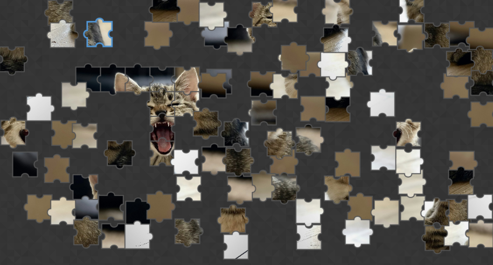

# 2D Jigsaw Puzzle Game

A fully-featured HTML5 canvas-based jigsaw puzzle game built with TypeScript and SCSS. Create puzzles from preset images or upload your own! **The game automatically saves your progress** - close your browser and return days later to continue exactly where you left off.



*Experience smooth drag-and-drop puzzle gameplay with automatic piece snapping and progress saving*

## 🎮 Gameplay

### Starting a Puzzle
- Click **"New Game"** to open the image selection menu
- Choose from two options:
  - **Gallery Tab**: Select from 15 beautiful preset images across 3 categories
  - **Upload Tab**: Upload your own image file

### Image Categories
- **Kittens** (5 images): Adorable cats and kittens
- **Ocean** (5 images): Marine life and underwater scenes
- **Landscapes** (5 images): Stunning nature photography

### Playing
- **Drag pieces** around the canvas to move them
- **Pieces snap together** automatically when placed correctly
- **Group formation**: Connected pieces move together as a unit
- **Visual feedback**: Correctly placed pieces have subtle highlighting
- **Progress tracking**: Watch your completion percentage
- **Auto-save**: Game state persists across browser sessions - **resume anytime!**

### Controls
- **Mouse drag**: Move puzzle pieces
- **Piece count slider**: Choose 30-300 pieces before starting
- **New Game button**: Start over at any time
- **Auto-hide header**: Move mouse to top of screen to access menu during gameplay

## 🚀 Getting Started

### Prerequisites
- Node.js (v16 or higher)
- npm

### Installation
```bash
git clone <repository-url>
cd puzzle-game
npm install
```

### Development
```bash
# Start development server with hot reload
npm run dev

# Visit http://localhost:5173 (or check console for actual port)
```

### Building
```bash
# Build for production
npm run build

# Output files will be in dist/ directory
```

## 🌐 Deployment

### GitHub Pages
This project includes a GitHub Action that automatically deploys to GitHub Pages:

1. **Enable GitHub Pages** in your repository settings:
   - Go to Settings → Pages
   - Source: "GitHub Actions"

2. **Push to main branch** - the action will automatically:
   - Install dependencies
   - Build the TypeScript and SCSS
   - Deploy to GitHub Pages

3. **Access your game** at: `https://yourusername.github.io/repository-name`

The deployment happens automatically on every push to the main branch using the workflow in `.github/workflows/deploy.yml`.

### Manual Deployment
You can also deploy manually to any static hosting service:
```bash
npm run build
# Upload the entire project directory (includes index.html, dist/, assets/)
```

### Available Scripts
- `npm run dev` - Start development server with TypeScript/SCSS watching
- `npm run build` - Build production assets
- `npm run build:ts` - Compile TypeScript only
- `npm run build:css` - Compile SCSS only
- `npm run watch:ts` - Watch TypeScript files
- `npm run watch:css` - Watch SCSS files

## 🏗️ Architecture

### Core Components
- **Game.ts**: Main game engine, handles piece generation, interactions, and game state
- **PuzzlePiece.ts**: Individual puzzle piece logic with collision detection
- **UIManager.ts**: Menu system, image selection, and user interface
- **CanvasRenderer.ts**: Rendering engine for drawing pieces and effects
- **persistence.ts**: Save/load game state with image compression

### Technical Features
- **TypeScript**: Full type safety and modern JavaScript features
- **HTML5 Canvas**: Hardware-accelerated rendering
- **Dark Theme**: Modern UI with subtle patterns background
- **Auto-Hide Header**: Sliding header with mouse detection for distraction-free gameplay
- **Modular Design**: Clean separation of concerns
- **State Persistence**: LocalStorage with automatic compression - **never lose progress**
- **Responsive**: Works on desktop and mobile devices
- **Error Handling**: Graceful failure recovery

### File Structure
```
src/
├── Game.ts              # Main game logic
├── PuzzlePiece.ts       # Puzzle piece implementation
├── UIManager.ts         # User interface management
├── CanvasRenderer.ts    # Canvas rendering
├── persistence.ts       # Save/load functionality
├── defaultImages.ts     # Preset image configuration
├── utils.ts             # Utility functions
├── types.ts             # TypeScript type definitions
├── styles.scss          # Styling (SCSS)
└── index.ts             # Application entry point

assets/
├── bg/                  # Background patterns
│   └── subtle_patterns_toptal-prism.png
├── screenshots/         # Documentation images
│   └── gameplay.png     # Main gameplay screenshot
└── images/              # Local preset images
    ├── kittens/         # Cat images
    ├── ocean/           # Marine life images
    └── landscapes/      # Nature images
```

## 🎯 Code Creation Process

This game was built collaboratively with Claude AI over multiple sessions:

### Session 1: Foundation
- Set up TypeScript build system with tsc + sass
- Implemented core puzzle piece generation with irregular shapes
- Created drag & drop interaction system
- Built basic canvas rendering pipeline

### Session 2: Enhanced Gameplay
- Added piece snapping and collision detection
- Implemented group movement for connected pieces
- Created completion detection and visual feedback
- Added responsive canvas resizing

### Session 3: Persistence & Gallery
- **Major Bug Fixes**: Resolved localStorage quota exceeded errors through image compression
- **State Persistence**: Fixed game state serialization issues with proper group handling
- **Default Image Gallery**: Added 15 preset images with tabbed interface and category selection
- **CORS Resolution**: Downloaded images locally to eliminate cross-origin issues
- **Polish**: Added error handling, loading states, and user feedback

### Session 4: Dark Theme & UI Enhancement  
- **Dark Theme Implementation**: Complete visual overhaul with subtle patterns background
- **Auto-Hide Sliding Header**: Mouse-activated header with 500ms delay and 20px detection zone
- **Image Gallery Reorganization**: Renamed "seals" to "ocean" category with proper marine-themed images
- **Modal Layout Enhancement**: Expanded to 700px width for perfect 5-column image grid
- **Image Asset Updates**: Replaced problematic images with high-quality Unsplash alternatives
- **Header Sensitivity Optimization**: Refined mouse detection to prevent accidental triggers

### Key Technical Decisions
- **No External Frameworks**: Pure TypeScript/HTML5 for maximum performance
- **Canvas-Based**: Hardware acceleration for smooth 60fps gameplay  
- **Local Assets**: Embedded images to avoid CORS and network dependencies
- **Dark Theme Design**: Modern aesthetic with subtle texture patterns
- **Progressive Enhancement**: Auto-hide UI for distraction-free gameplay
- **Modular Architecture**: Clean separation for maintainability
- **Type Safety**: Full TypeScript coverage for bug prevention

## 🎨 Customization

### Adding New Images
1. Place images in `assets/images/<category>/`
2. Update `src/defaultImages.ts` with new entries
3. Images should be high resolution (1500px+) for best puzzle quality

### Adjusting Difficulty
- Modify piece count range in `index.html` (piece-slider min/max)
- Adjust snap distance in `Game.ts` (SNAP_DISTANCE constant)
- Change piece complexity in puzzle generation algorithm

### Styling
- **Dark Theme**: Modern dark UI with subtle texture backgrounds
- **Main styles**: All styling in `src/styles.scss`
- **SCSS variables**: Easy color/spacing customization
- **Responsive design**: CSS Grid and Flexbox layouts
- **Auto-hide header**: Sliding animation with mouse detection

## 🐛 Known Limitations

- Large images (>4MB compressed) may hit localStorage limits
- Mobile touch interactions could be enhanced
- No undo/redo functionality
- Piece shapes are generated algorithmically (not hand-crafted)

## 📄 License

This project uses images from Unsplash under their free license. Code is available for educational and personal use.

---

*Built with ❤️ using TypeScript, HTML5 Canvas, and collaborative AI development*